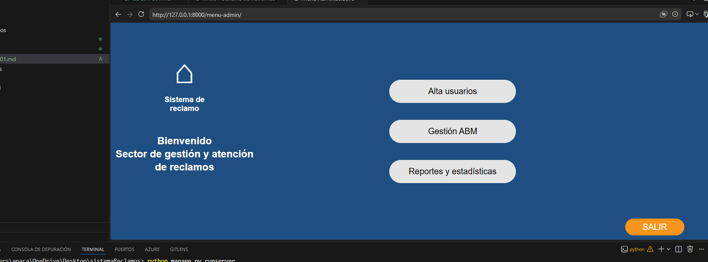

# Caso de Prueba: CP-LOGIN-001

## Módulo
Login

## Descripción
Validar que el sistema permita el acceso correcto con usuario administrador.

## Precondiciones
- Usuario "admin" creado en la base de datos.
- Contraseña válida registrada.

## Pasos
1. Abrir la aplicación y acceder al formulario de login.
2. Ingresar usuario: `admin`.
3. Ingresar contraseña correcta.
4. Presionar el botón **Ingresar**.

## Resultado esperado
El sistema redirige al menú de administración (`menu_admin.html`) mostrando las opciones disponibles para el administrador.

## Evidencia
Captura de pantalla del acceso exitoso.

## Resultado obtenido
El sistema permitió el acceso y mostró el menú de administración.

## Estado
Aprobado ✅

## Evidencia

